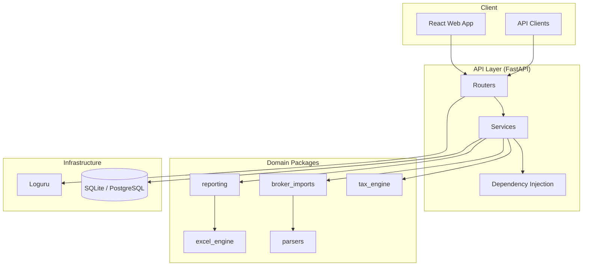

# ITcopilot

**Production-grade, open-source AI-powered Income Tax Copilot for India**

[](https://github.com/itcopilot/itcopilot/actions/workflows/ci.yml)
[](LICENSE)
[](https://www.python.org/downloads/)
[](https://github.com/astral-sh/ruff)

ITcopilot helps Indian taxpayers compute income tax liability, import broker statements, generate ITR summaries, and manage tax assessments — built with enterprise-grade architecture and production-ready standards.

---

## Features

- **Tax Computation Engine** — Old and new regime with slab-wise breakdown, surcharge, and cess
- **Document Parsing** — PDF and CSV financial statement extraction
- **Broker Import** — Zerodha tradebook import with extensible broker registry
- **Report Generation** — ITR summary reports in Excel and plain text
- **REST API** — FastAPI with Swagger/ReDoc, structured logging, and dependency injection
- **Web Dashboard** — React + TypeScript + Tailwind frontend
- **Docker Ready** — Multi-stage builds for development and production

## Architecture



## Technology Stack

| Layer | Technologies |
|-------|-------------|
| Backend | Python 3.12, FastAPI, Pydantic v2, SQLAlchemy 2, Alembic |
| Data | Polars, PyArrow, pdfplumber, OpenPyXL |
| Frontend | React, TypeScript, Vite, Tailwind CSS, ESLint |
| Database | SQLite (dev), PostgreSQL (prod) |
| Auth | JWT (python-jose), bcrypt |
| DevOps | Docker, Docker Compose, GitHub Actions, pre-commit |
| Quality | pytest (95% coverage floor), ruff, mypy, bandit |

## Installation

### Prerequisites

- Python 3.12+
- Node.js 20+ (for frontend)
- Docker & Docker Compose (optional)

### Quick Start

```bash
# Clone repository
git clone https://github.com/itcopilot/itcopilot.git
cd itcopilot

# Create virtual environment
python -m venv .venv

# Activate (Windows)
.venv\Scripts\activate
# Activate (macOS/Linux)
source .venv/bin/activate

# Install dependencies
pip install -e ".[dev]"

# Configure environment
cp .env.example .env

# Initialize database
python scripts/init_db.py

# Start API server
python scripts/dev_server.py
```

## Development Setup

```bash
# Install pre-commit hooks
pre-commit install

# Start frontend (separate terminal)
cd apps/web
npm install
npm run dev
```

### API Endpoints

| Endpoint | Method | Description |
|----------|--------|-------------|
| `/api/v1/health` | GET | Readiness check (includes DB connectivity) |
| `/api/v1/health/live` | GET | Liveness probe |
| `/api/v1/health/ready` | GET | Readiness probe |
| `/api/v1/version` | GET | Application version |
| `/api/v1/auth/token` | POST | Obtain JWT access token |
| `/api/v1/tax/compute` | POST | Compute income tax |
| `/api/v1/tax/assessments` | GET | List assessments |
| `/api/v1/tax/assessments/{id}` | GET | Get assessment |
| `/docs` | GET | Swagger UI |
| `/redoc` | GET | ReDoc documentation |

Tax endpoints require `Authorization: Bearer <token>` when `AUTH_ENABLED=true` (forced in production). In development, auth is disabled by default.

### Example: Compute Tax

```bash
curl -X POST http://localhost:8000/api/v1/tax/compute \
  -H "Content-Type: application/json" \
  -d '{
    "pan": "ABCDE1234F",
    "assessment_year": "2025-26",
    "regime": "old",
    "gross_salary": "1500000",
    "other_income": "75000",
    "section_80c": "150000",
    "section_80d": "25000",
    "hra_exemption": "120000"
  }'
```

## Docker

```bash
# Development (API + Web + PostgreSQL)
docker compose up --build

# Production profile (requires SECRET_KEY and AUTH_ADMIN_PASSWORD_HASH)
export SECRET_KEY="$(python -c 'import secrets; print(secrets.token_hex(32))')"
export AUTH_ADMIN_PASSWORD_HASH="$(python -c 'from app.core.security import hash_password; print(hash_password("your-secure-password"))')"
docker compose --profile production up --build
```

Services:
- **API**: http://localhost:8000
- **Web**: http://localhost:5173
- **PostgreSQL**: localhost:5432

## Running Tests

```bash
# Full test suite with coverage
pytest

# Lint and type check
ruff check apps packages scripts tests
mypy apps/api/app packages
bandit -r apps/api/app packages
```

## Folder Structure

```
ITcopilot/
├── .github/workflows/     # CI/CD pipelines
├── apps/
│   ├── api/               # FastAPI backend
│   │   ├── app/
│   │   │   ├── api/       # Exception handlers
│   │   │   ├── core/      # Settings, logging, DI
│   │   │   ├── db/        # Database layer
│   │   │   ├── models/    # SQLAlchemy models
│   │   │   ├── routers/   # API routes
│   │   │   ├── schemas/   # Pydantic schemas
│   │   │   ├── services/  # Business logic
│   │   │   └── utils/     # Utilities
│   │   └── tests/         # API tests
│   └── web/               # React frontend
├── packages/
│   ├── common/            # Shared types & validators
│   ├── tax_engine/        # Tax computation
│   ├── parsers/           # Document parsers
│   ├── broker_imports/    # Broker adapters
│   ├── excel_engine/      # Excel processing
│   └── reporting/         # Report generation
├── docs/                  # MkDocs documentation
├── docker/                # Docker configs
├── scripts/               # Utility scripts
├── sample_data/           # Test data
├── tests/                 # Package tests
├── Dockerfile
├── docker-compose.yml
└── pyproject.toml
```

## Roadmap

| Version | Focus |
|---------|-------|
| **v0.1.0** | Foundation — API, tax engine, parsers, Docker, CI |
| **v0.2.0** | Document processing — Form 16, AIS, 26AS, capital gains |
| **v0.3.0** | ITR filing — Form generation, e-filing export |
| **v0.4.0** | AI Copilot — Natural language queries, tax planning |
| **v0.5.0** | Enterprise — Multi-tenant, RBAC, CA dashboard |

See [docs/roadmap.md](docs/roadmap.md) for the full roadmap.

## Contributing

We welcome contributions! Please read our [Contributing Guide](CONTRIBUTING.md) and [Code of Conduct](CODE_OF_CONDUCT.md) before submitting pull requests.

```bash
# Development workflow
git checkout -b feature/my-feature
pytest
ruff check .
git commit -m "feat(scope): description"
git push origin feature/my-feature
```

## Security

Report security vulnerabilities to **security@itcopilot.dev**. See [SECURITY.md](SECURITY.md) for our security policy.

## License

This project is licensed under the [Apache License 2.0](LICENSE).

---

Built with care for the Indian taxpayer community.
