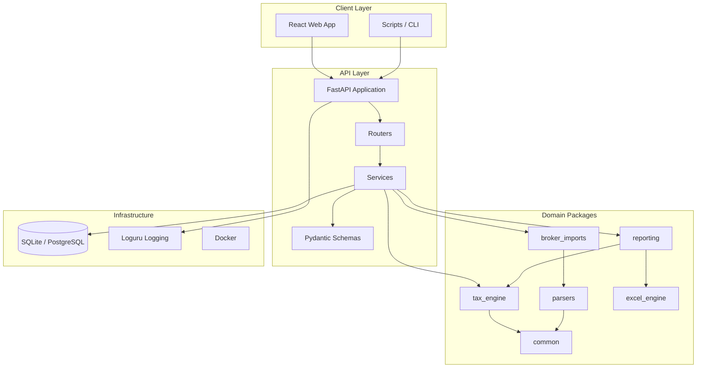
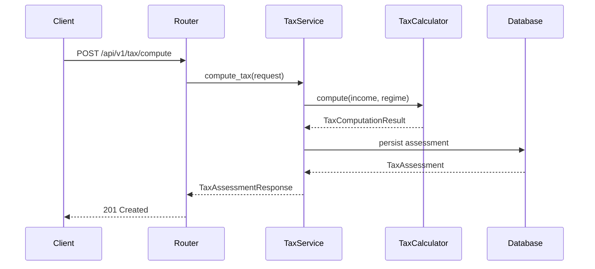
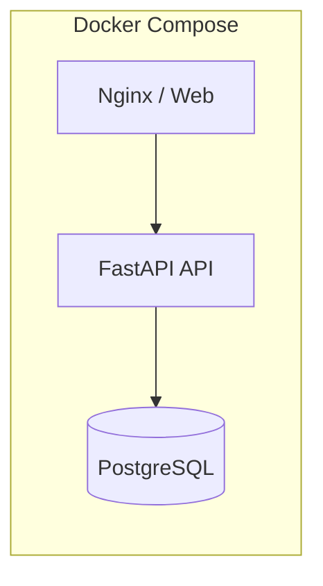

# Architecture

## System Overview

ITcopilot follows clean architecture principles with clear separation between API, domain packages, and infrastructure.

## Layer Responsibilities

### API Layer (`apps/api`)

- HTTP request handling and routing
- Input validation via Pydantic schemas
- Dependency injection for services and database sessions
- Exception handling and structured error responses

### Domain Packages (`packages/`)

| Package | Responsibility |
|---------|---------------|
| `common` | Shared types, constants, validators |
| `tax_engine` | Income tax computation (old/new regime) |
| `parsers` | PDF, CSV document parsing |
| `broker_imports` | Broker statement import adapters |
| `excel_engine` | Excel read/write operations |
| `reporting` | Tax report generation |

### Infrastructure

- **Database**: SQLAlchemy 2 async with SQLite (dev) / PostgreSQL (prod)
- **Logging**: Loguru with console and rotating file handlers
- **Configuration**: pydantic-settings with environment-based profiles

## Design Principles

1. **Dependency Injection** — FastAPI `Depends()` for settings, DB sessions, services
2. **SOLID** — Single-responsibility services, interface-based parsers/importers
3. **Typed Python** — 100% type hints with strict MyPy
4. **Domain-Driven Design** — Tax computation logic isolated in `tax_engine` package

## Data Flow: Tax Computation

## Deployment Architecture

Production deployments use multi-stage Docker builds with non-root user, health checks, and PostgreSQL.
