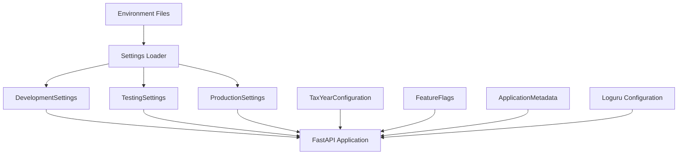

# Configuration Guide

ITcopilot Module 2 introduces a production-grade configuration engine at `packages/common/config/`. This layer is the **single source of truth** for environment settings, tax defaults, feature flags, logging, and application metadata.

## Architecture



## Package Layout

```
packages/common/config/
├── __init__.py          # Public exports
├── settings.py          # Environment profiles and singleton loader
├── constants.py         # Shared configuration constants
├── types.py             # Typed enums and models
├── validators.py        # Validation helpers
├── exceptions.py        # ConfigurationError
├── tax_config.py        # Multi-year tax configuration registry
├── feature_flags.py     # Runtime feature toggles
├── metadata.py          # Application metadata
└── logging.py           # Loguru setup (console + JSON files)
```

## Environment Files

| File | Purpose |
|------|---------|
| `.env.example` | Template with all supported variables |
| `.env.development` | Local development defaults |
| `.env.testing` | CI and pytest defaults |
| `.env.production` | Production deployment template |

Copy `.env.example` to `.env` for local work, or set `ENVIRONMENT` to load the matching profile automatically.

### Core Variables

| Variable | Description |
|----------|-------------|
| `ENVIRONMENT` | `development`, `testing`, or `production` |
| `APP_NAME` | Application display name |
| `APP_VERSION` | Semantic version |
| `API_VERSION` | REST API version label |
| `DEBUG` | Enable debug mode |
| `HOST` / `PORT` | API bind address (aliases: `API_HOST`, `API_PORT`) |
| `DATABASE_URL` | SQLAlchemy async connection URL |
| `SECRET_KEY` | Application secret |
| `JWT_SECRET` | JWT signing secret (defaults to `SECRET_KEY`) |
| `JWT_ALGORITHM` | JWT algorithm (default: `HS256`) |
| `LOG_LEVEL` | Loguru log level |
| `LOG_JSON` | Enable JSON file logging |

### Feature Flags

| Variable | Default | Module |
|----------|---------|--------|
| `ENABLE_AI` | false | AI-assisted features |
| `ENABLE_EXCEL` | true | Excel engine |
| `ENABLE_PARSER` | true | Document parser |
| `ENABLE_REPORTS` | true | Reporting |
| `ENABLE_CACHE` | false | Distributed cache |
| `ENABLE_REST_API` | true | REST API surface |
| `ENABLE_BROKER_IMPORT` | true | Broker imports |
| `ENABLE_DASHBOARD` | true | Web dashboard |
| `ENABLE_POWER_BI` | false | Power BI export |
| `ENABLE_EXPERIMENTAL` | false | Preview features |
| `CACHE_URL` | — | Required when `ENABLE_CACHE=true` |

## Settings Profiles

The loader automatically selects a profile based on `ENVIRONMENT`:

```python
from common.config import get_settings, load_settings, Environment

settings = get_settings()  # cached singleton
fresh = load_settings(Environment.TESTING.value)  # uncached
```

| Profile | Class | Key Defaults |
|---------|-------|--------------|
| Development | `DevelopmentSettings` | `DEBUG=true`, auth disabled, text logs |
| Testing | `TestingSettings` | in-memory SQLite, auth disabled |
| Production | `ProductionSettings` | strict secrets, Alembic-only schema, JSON logs |

## Tax Configuration

Tax rules are registered per assessment year in `tax_config.py`:

```python
from common.config import get_tax_year_config, TaxRegime

config = get_tax_year_config("2025-26")
slabs = config.get_slabs(TaxRegime.NEW)
cess = config.health_education_cess_rate
limits = config.section_80_limits.section_80c
```

Each `TaxYearConfiguration` includes:

- Financial year and assessment year
- Old/new regime slabs
- Health and education cess
- Surcharge thresholds
- Section 80 limits
- Capital gain rates
- FIFO configuration
- Grandfathering rules

## Logging

Loguru is configured via `common.config.logging.configure_logging()`:

- **Console**: colored output with module context
- **Files**: daily rotation with retention policy
- **JSON**: structured logs when `LOG_JSON=true` (default in production)
- **Testing**: console-only (no file handlers)

## Validation

The configuration engine validates at load time:

- Missing required production variables
- Invalid assessment year or tax regime
- Invalid log level, host, or port
- Unsupported database URL scheme
- Cache enabled without `CACHE_URL`
- Insecure production secrets

## FastAPI Integration

The API layer re-exports the configuration engine from `app.core.settings`:

```python
from app.core.settings import Settings, get_settings, Environment
from app.core.logging import configure_logging
```

Production guards (secret key length, auth hash, schema creation) are enforced in `BaseAppSettings.finalize_settings()`.

## Testing

Configuration tests live in `tests/config/`:

```bash
pytest tests/config/ -v
```

Use `reset_settings_cache()` between tests that modify environment variables.
